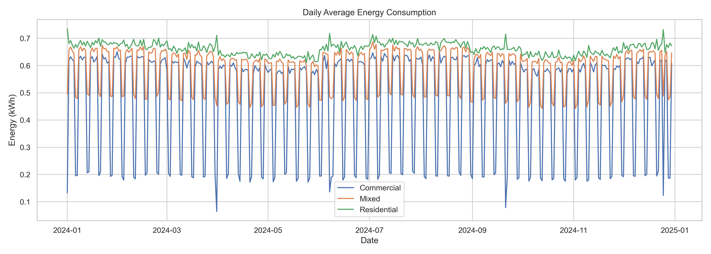
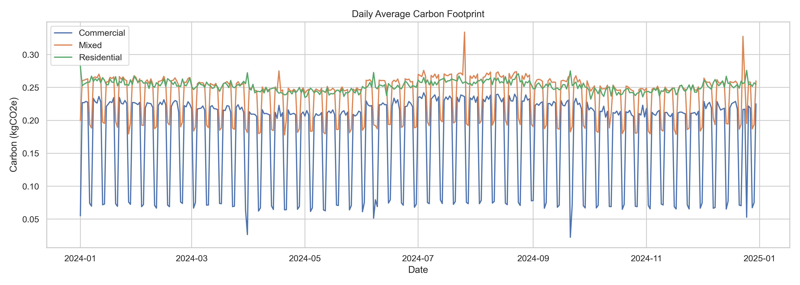

# 🔋 Real-Time Energy Forecasting & Carbon Impact Dashboard

This project simulates, forecasts, and visualizes building energy consumption while estimating the carbon footprint in a modular, production-ready pipeline. It’s designed for energy efficiency analytics, carbon reduction strategies, and professional data science portfolio demonstration.

---

## ✅ Phase 1: Synthetic Data Generation & Visualization

**Objective:** Simulate realistic hourly energy consumption patterns across Residential, Commercial, and Mixed sectors and visualize them alongside carbon emissions.

### 📌 Deliverables
- **Synthetic Dataset Generator**:
  - Residential, Commercial, and Mixed-use building profiles
  - 365-day, hourly resolution
  - Diurnal cycles, weekly trends, temperature effects, holidays
- **Carbon Emissions Estimation**:
  - Based on Malta’s national emission factor: `396 gCO₂e/kWh`
- **Modular File Loader**:
  - Robust loading of datasets from any location within project
- **Visualization Notebook**:
  - Daily average plots for energy use and carbon impact
  - 7-day rolling averages for trend clarity

---

### 📁 Key Files

| File | Description |
|------|-------------|
| `scripts/synthetic_data_generator.py` | Generates hourly synthetic datasets with temperature and emissions |
| `notebooks/01_visualize_synthetic_data.ipynb` | Visualizes energy and carbon data with smoothed plots |
| `src/utils/loader.py` | Universal file loader supporting relative paths |
| `data/raw/synthetic/*.csv` | Generated energy and carbon data (optionally excluded from Git) |

---

## 🗂 Project Structure

```
energy_forecasting_dashboard/
├── notebooks/                   ← Visualizations and analysis
├── scripts/                     ← Data generation scripts
├── src/utils/                   ← Modular reusable functions (loaders, config, logging)
├── data/
│   └── raw/synthetic/           ← Hourly synthetic datasets
├── README.md                    ← Project documentation
├── .gitignore                   ← Ignore rules for clean Git commits
├── environment.yml              ← Conda environment specification
├── requirements.txt             ← pip alternative (optional)
```

---

## 🧭 Phase 2 Preview: Forecasting

We will now build time-series forecasting models to predict future energy consumption and carbon output:

- 📈 Prophet for trend/seasonality modeling
- ⚡ XGBoost for feature-rich regression
- 🔁 Linear Regression baseline
- 📊 Evaluation (RMSE, MAE, MAPE)
- 🌱 Carbon estimation from forecasts

---

## 🚀 Getting Started

To generate synthetic data:

```bash
python scripts/synthetic_data_generator.py
```

To visualize it:

```bash
Open notebooks/01_visualize_synthetic_data.ipynb in Jupyter or VS Code
```

---

## 🏷️ Version

Current milestone: **v0.1.0 – Phase 1 complete**

- Synthetic generator  
- Carbon integration  
- Smoothed visualization  
- Modular project structure
## 📊 Sample Visualizations

### 🔌 Daily Energy Consumption 


### 🌍 Daily Carbon Footprint 
